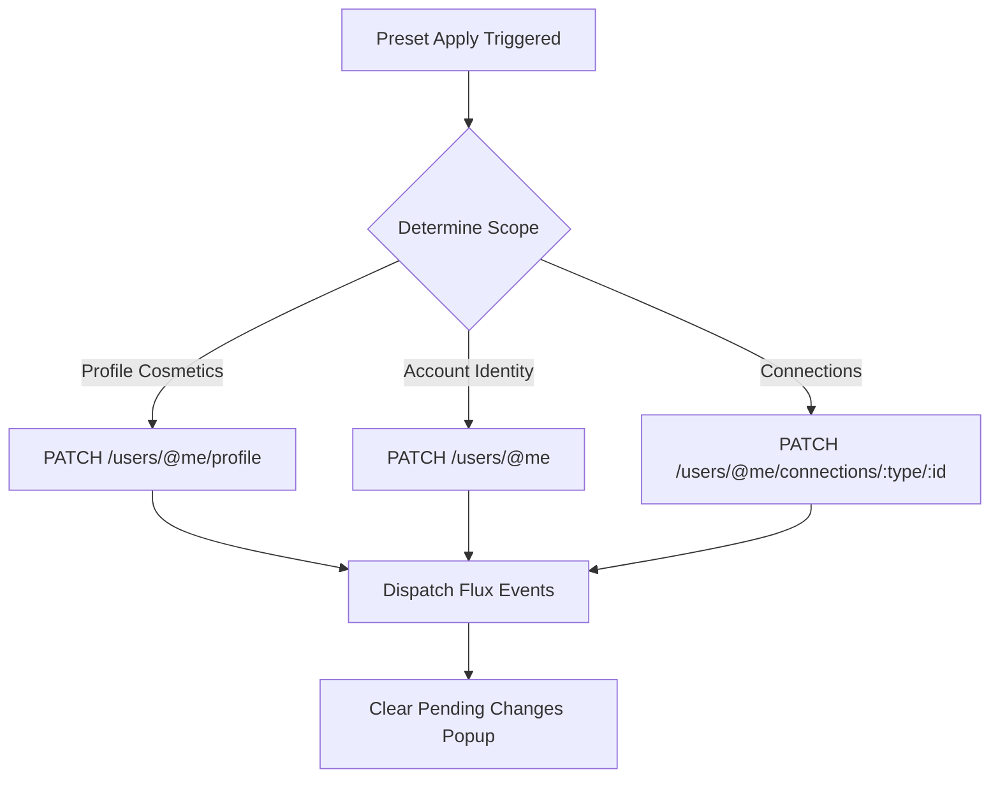

# Profile Presets

[](https://github.com/OkzTy/discord-profile-presets-plugins)
[](https://github.com/OkzTy/discord-profile-presets-plugins)

A high-performance Discord plugin for **Equicord** and **Vencord** that allows you to capture, manage, and instantly switch your entire Discord profile identity with a single click.

> [!NOTE]
> **Profile Presets** safely patches your profile directly via Discord's official endpoints, updating your Avatar, Banner, Profile Effects, Profile Frames/Borders, Nameplate, Display Name Styles, Bio, Pronouns, Theme Colors, Clan Tags, and Connected Accounts visibility without requiring client reloads or dangerous token injections.

---

## Overview & Interface

| Quick Menu | Live Preset Studio |
| :---: | :---: |
|  |  |

---

## Supported Profile Items

**Profile Presets** captures every single aesthetic element of your Discord profile into a standalone preset:

| Category | Cosmetic / Field | Description & Payload Specs |
|---|---|---|
| **Avatar** | Profile Picture | Animated GIF or static PNG (auto-converted to Data URIs & downscaled). |
| **Banner** | Profile Banner | Animated GIF or static PNG up to 512px resolution. |
| **Collectibles** | Profile Effect | Full support for `profile_effect_id` strings and shop collectibles. |
| **Collectibles** | Profile Border / Frame | Full support for `profile_frame_sku_id` decorations. |
| **Collectibles** | Avatar Decoration | Full support for `avatar_decoration_sku_id`. |
| **Collectibles** | Nameplate | Full support for `nameplate_sku_id` decorations. |
| **Identity** | Display Name | Custom global name (`global_name`). |
| **Identity** | Display Name Styles | Custom gradient colors (`colors`), font family (`font_id`), and special effects (`effect_id`). |
| **Identity** | Pronouns | Custom pronouns string (`pronouns`). |
| **Identity** | About Me (Bio) | Full markdown-formatted bio (`bio`). |
| **Identity** | Clan Tag | Guild identity tag (`primary_guild_id`). |
| **Identity** | Custom Status | Custom status text, custom emoji ID/name, and expiration timers. |
| **Theme** | Primary & Secondary Colors | Dual accent theme colors (`theme_colors: [int, int]`) or legacy accent color (`accent_color`). |
| **Connections** | Connected Accounts | Toggles visibility (`1` = visible, `0` = hidden) and activity sharing across linked accounts (GitHub, Twitch, Spotify, Steam, etc.). |

---

## Key Features

- **Instant UserArea Quick Menu**: A sleek preset switcher added directly to the Discord user area footer for 1-click preset activation.
- **Grand Live Preset Studio**: Full interactive modal with live card previews, draft drawer editing, export/import JSON capabilities, and filtered views.
- **In-Menu Interactive Confirmation Banners**: Non-intrusive sticky confirmation banners rendered directly inside the active menu overlay for overwriting or deleting presets.
- **Dual-Layer Persistence**: Presets are synced simultaneously to Equicord's internal `DataStore` and saved as structured folders directly on disk (`src/userplugins/profilePresets/Presets/`).
- **Disk File Auto-Deduplication**: Automatic directory cleanup guaranteeing exactly 1 disk folder per preset name.
- **Zero-Reload Store Syncing**: Triggers native Discord Flux Dispatchers (`USER_PROFILE_FETCH_SUCCESS`, `CURRENT_USER_UPDATE`) to ensure your client state updates immediately on Discord servers.

---

## 📦 Installation Guide

### Option 1: Via UserPluginInstaller (Recommended)

1. Open **Discord**.
2. Go to **User Settings → UserPlugins** (or open the Plugin Installer tab).
3. Paste the repository URL into the installer field:
   ```text
   https://github.com/OkzTy/discord-profile-presets-plugins
   ```
4. Click **Install Plugin** and restart Discord when prompted.

---

### Option 2: Manual Installation (Equicord / Vencord Source)

1. Navigate to your Equicord or Vencord root directory:
   ```bash
   cd Equicord/src/userplugins
   ```
2. Clone or copy the plugin files into a folder named `profilePresets`:
   ```bash
   git clone https://github.com/OkzTy/discord-profile-presets-plugins.git profilePresets
   ```
3. Build and inject the updated client:
   ```bash
   pnpm build --dev
   pnpm inject -- -install -branch stable
   ```
4. Restart Discord.

---

## Technical Architecture & Internals

### 1. Dual-Endpoint REST Patching

Discord separates account settings between `/users/@me` and `/users/@me/profile`. **Profile Presets** batches patches logically into atomic REST operations to minimize rate limits:



#### Primary Payload Schemes:
- **`PATCH /users/@me/profile`**:
  ```json
  {
    "bio": "Sample Bio",
    "pronouns": "they/them",
    "theme_colors": [5800000, 1000000],
    "banner": "data:image/png;base64,...",
    "profile_effect_id": "1157813523772276800",
    "profile_frame_sku_id": "123456789012345678",
    "avatar_decoration_sku_id": "987654321098765432",
    "nameplate_sku_id": "112233445566778899"
  }
  ```
- **`PATCH /users/@me`**:
  ```json
  {
    "global_name": "Display Name",
    "avatar": "data:image/png;base64,...",
    "primary_guild_id": "1234567890",
    "display_name_styles": {
      "font_id": 1,
      "effect_id": 2,
      "colors": [16711680, 255]
    }
  }
  ```

---

### 2. Store Integration & Event Dispatching

After patching endpoints, the plugin updates Discord's internal Webpack state stores without requiring a browser refresh:

- **`UserProfileSettingsStore`**: Clears transient uncommitted change banners via `USER_PROFILE_SETTINGS_RESET_PENDING_CHANGES`.
- **`UserProfileStore`**: Updates local profile cache via `USER_PROFILE_FETCH_SUCCESS`.
- **`UserStore`**: Updates current user account object via `CURRENT_USER_UPDATE` & `USER_SETTINGS_ACCOUNT_SUBMIT_SUCCESS`.

---

### 3. Disk Synchronization Schema

Presets are saved directly to disk as human-readable JSON files and asset folders:

```text
src/userplugins/profilePresets/Presets/
├── anime_pink_a1b2c3d4/
│   ├── preset_info.json
│   ├── avatar.png (or avatar.gif)
│   └── banner.png (or banner.gif)
└── gamer_mode_e5f6g7h8/
    ├── preset_info.json
    └── avatar.png
```

---

## ❓ Troubleshooting & FAQ

| Problem | Cause | Solution |
|---|---|---|
| **Overwrite warning appears hidden** | Stacking context or modal z-index layer. | All confirmation banners are prepended directly to the top of the active menu container (`zIndex: 100000`). |
| **Profile Effect or Border not saving** | API payload used incorrect string key. | Deep collectible extractors parse `profile_effect_id` and `profile_frame_sku_id` across all Discord response structures. |
| **Duplicate preset folders on disk** | Legacy IDs created separate folders for the same preset name. | Automatic disk deduplication ensures 1 folder per preset name. |
| **GIF avatar / banner static after save** | Image was downscaled through 2D Canvas. | Animated GIFs are preserved as base64 `data:image/gif` URIs without Canvas re-encoding. |

---

<div align="center">

### Credits & Acknowledgments

**Profile Presets** was enhanced with ❤️ by **[OkzTy](https://github.com/OkzTy)**.

Special thanks and acknowledgment to **[Osihra](https://github.com/Osihra)** for the original project **[Osihra/Vencord-Plugin-Profile-Presets](https://github.com/Osihra/Vencord-Plugin-Profile-Presets)**, which provided the original foundation and inspired the creation of this plugin.

<br>

If this helped you, **drop a ⭐ star** it keeps the project alive.

<br><br>


</div>
